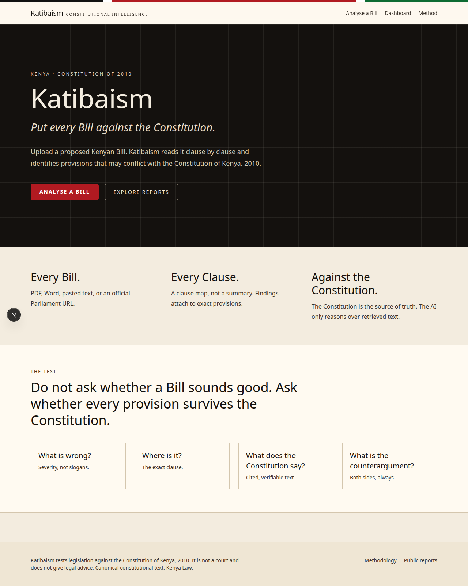
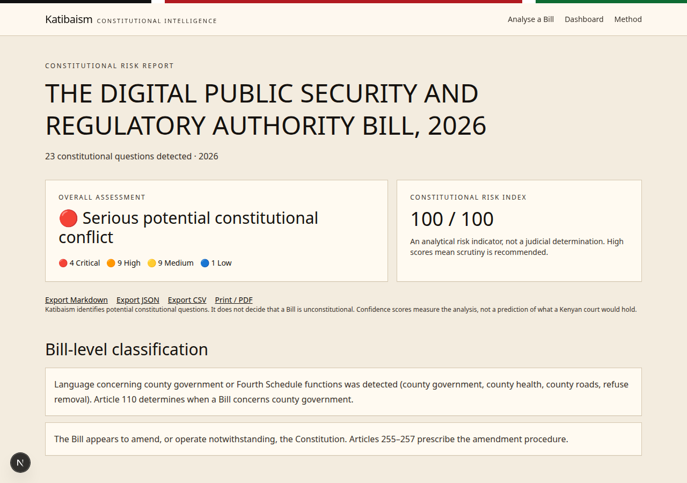

# Katibaism

**Put every Bill against the Constitution.**

Katibaism is constitutional intelligence for Kenya. It reads a proposed Bill clause by clause and tests it against the Constitution of Kenya, 2010.

It does not ask a language model whether a Bill is constitutional. The Constitution is the source of truth. Any model, if configured, only reasons over retrieved and verified text.

Katibaism is not a court and does not give legal advice.

## Demo





**Walkthrough (1:01)**

<audio controls src="docs/katibaism-walkthrough.mp3"></audio>

[Download walkthrough MP3](docs/katibaism-walkthrough.mp3)

## What it does

1. Upload a PDF or Word file, paste Bill text, or fetch an official Parliament / Kenya Law URL.
2. Extract and segment clauses. Text PDFs are read first; scanned pages go through OCR.
3. Retrieve relevant articles from a versioned Kenya Law knowledge base.
4. Run deterministic constitutional tests (conflict, rights, delegation, procedure, money, institutions, equality, administrative justice, offences, hidden issues, escape hatches).
5. Verify every citation against the knowledge base.
6. Show the clause beside the Constitution, with a counterargument, severity and confidence. Rights findings that cite Article 24 walk Test B (eight questions) instead of only pointing at the article.
7. Export Markdown, JSON or CSV, and print a PDF-ready report.

## Run it

```bash
npm install
npm test
npm run dev
```

Open [http://localhost:3000](http://localhost:3000). Use **Try the sample 2026 Bill** to see the engine on a deliberately difficult draft.

Optional LLM refinement: copy `.env.example` to `.env.local` and set one provider key. Without a key, the deterministic engine still produces cited findings.

## Knowledge base

`data/constitution/kenya-2010.v1.json` is parsed from the official Kenya Law HTML publication of the Constitution of Kenya, 2010.

```bash
npm run constitution:parse
```

Do not silently overwrite that file. Analyses record `constitution_version`, `rules_version` and timestamps.

## How we work

- The Constitution, not the model, is the authoritative source.
- Every constitutional claim must carry a verified citation.
- Do not invent articles, quotations, cases or parliamentary procedures.
- Katibaism surfaces questions and evidence. It does not declare a Bill unconstitutional unless reporting a court decision.
- Analysis must not use political party, sponsor, ideology or popularity.

## Contributing

This project is maintained in the open. If you want to help:

1. Open an issue describing the problem or the constitutional test you want to add.
2. Fork the repository and work on a branch.
3. Add or update tests for any change to extraction, rules, retrieval or citation verification.
4. Open a pull request.

Legal, product, journalism and engineering help are all welcome. High-risk findings should be reviewed by a Kenyan constitutional lawyer before they are treated as authoritative.

## License

Copyright © 2026 Katibaism contributors.

Licensed under the Apache License, Version 2.0. See `LICENSE`.

Constitutional text included in this repository is reproduced from the [Kenya Law](https://new.kenyalaw.org/akn/ke/act/2010/constitution) publication of the Constitution of Kenya, 2010.
